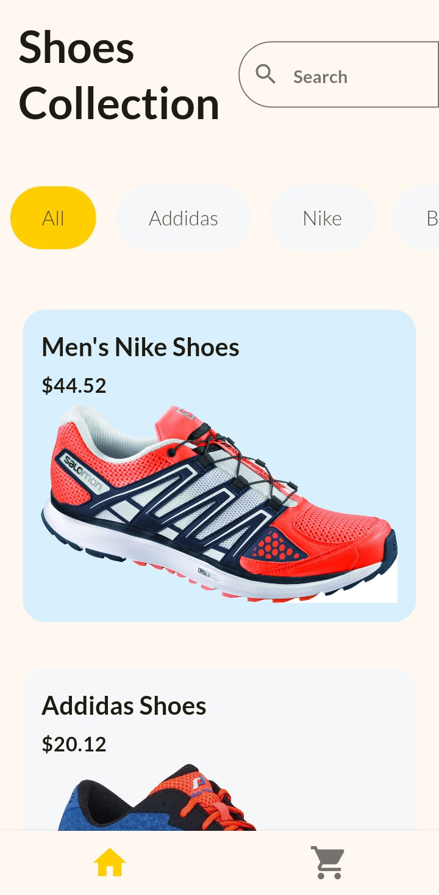
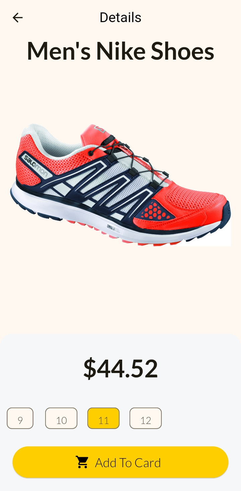
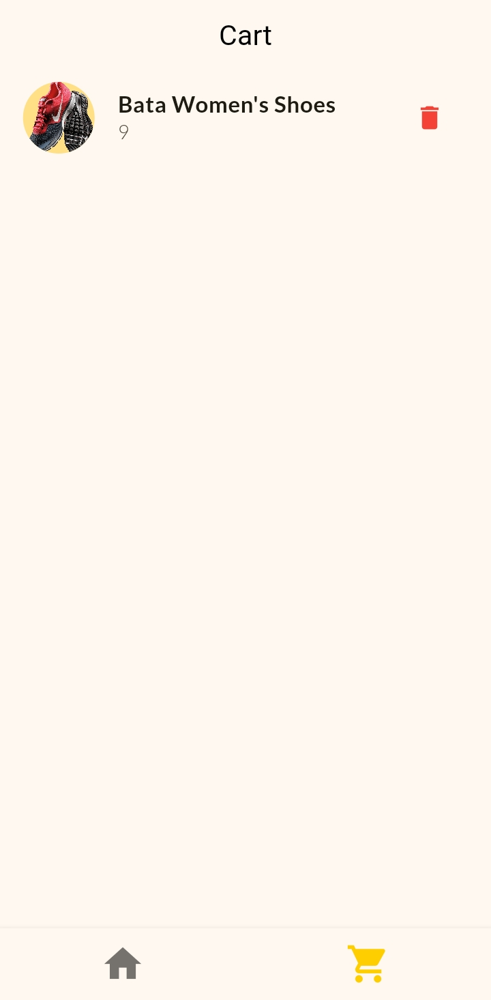

# Shoes Shop App

A simple shop app built with Flutter to showcase basic UI building knowledge and using Provider for state management.

## Features

- Search for products by brand
- Filter products by brand (Adidas, Nike)
- Display product list with images and prices

## Running the app

Clone the repository

```
git clone https://github.com/withmohitjoshi/shop_app.git
```

Navigate to the directory

```
cd ./shop_app
```

Install required packages

```
flutter pub get
```

Run the app

```
flutter run
```

## Snapshots




